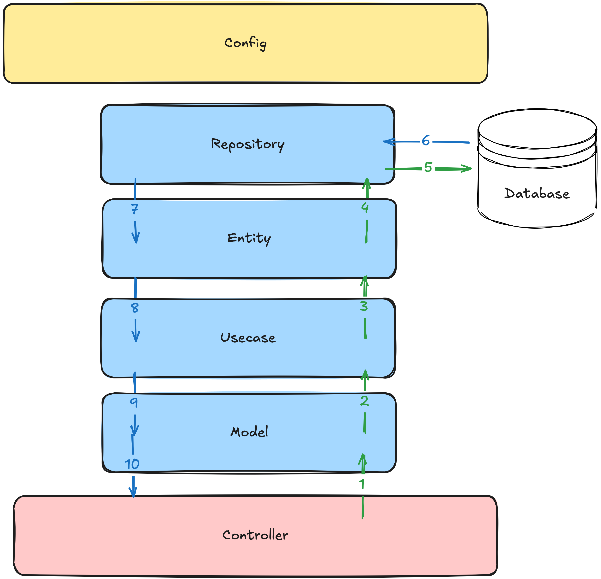

# go-template

A Go REST API template built with [Fiber](https://gofiber.io/) following a clean/layered architecture. It currently ships a user domain (register, login, logout, get/update current user) as a reference implementation of the pattern.

## Tech stack

| Concern | Library | Notes |
|---|---|---|
| HTTP framework | [`gofiber/fiber/v2`](https://github.com/gofiber/fiber) | Router, middleware, JSON responses |
| ORM / database | [`gorm.io/gorm`](https://gorm.io/) + `gorm.io/driver/postgres` | PostgreSQL access |
| Config | [`spf13/viper`](https://github.com/spf13/viper) | Loads `config.json` |
| Validation | [`go-playground/validator/v10`](https://github.com/go-playground/validator) | Struct tag validation on request models |
| Logging | [`sirupsen/logrus`](https://github.com/sirupsen/logrus) | JSON structured logs, also wired into GORM's logger |
| Password hashing | `golang.org/x/crypto/bcrypt` | User password storage |
| IDs | `google/uuid` | Available for entity/token generation |
| Testing | [`stretchr/testify`](https://github.com/stretchr/testify) | Assertions in `test/` |
| DB migrations | [`golang-migrate/migrate`](https://github.com/golang-migrate/migrate) CLI | SQL files in `db/migrations` (tool isn't a Go dependency, install separately) |
| API docs | Hand-written OpenAPI 3.1 (`api/openapi.yaml`) rendered with [Scalar](https://github.com/scalar/scalar) | Served by the app itself, see [API documentation](#api-documentation) |

Go version: see `go.mod` (`go 1.26.1`).

## Architecture / layers



Request flow: **HTTP → Delivery → Model → Use Case → Entity → Repository → Database**

| Layer | Path | Responsibility |
|---|---|---|
| **Delivery (HTTP)** | `internal/delivery/http` | Fiber controllers. Parse the request into a `model`, call the matching use case, translate the result/error into a `WebResponse` JSON body. Holds no business logic. |
| **Route** | `internal/delivery/http/route` | Registers controllers onto Fiber paths/methods and decides which routes require the auth middleware (`SetupGuestRoutes` vs `SetupAuthRoutes`). |
| **Middleware** | `internal/delivery/http/middleware` | Cross-cutting HTTP concerns, e.g. `auth_middleware.go` validates the `Authorization` header token before letting a request reach a protected controller. |
| **Model** | `internal/model` | Plain DTOs: request payloads (`RegisterUserRequest`, ...), response payloads (`UserResponse`), and the generic `WebResponse[T]` envelope used for every JSON response. Never persisted directly. |
| **Converter** | `internal/model/converter` | Maps `entity` → `model` (e.g. `entity.User` → `model.UserResponse`), keeping persistence fields (like the password hash) out of API responses. |
| **Use Case** | `internal/usecase` | Business logic: validates input, applies rules (e.g. reject duplicate registration with 409, hash passwords, issue tokens), orchestrates one or more repositories inside a DB transaction. |
| **Entity** | `internal/entity` | Structs mapped to database tables via GORM tags (e.g. `entity.User`). Represents persisted data, not API shape. |
| **Repository** | `internal/repository` | Generic CRUD (`Repository[T]`) plus entity-specific queries (e.g. `UserRepository.FindByToken`). Only layer that talks to `gorm.DB` directly. |
| **Config** | `internal/config` | Wires everything together: Viper config loading, GORM/Postgres connection, Fiber app + error handler, logrus logger, validator instance, and `Bootstrap()` which assembles repositories → use cases → controllers → routes. |

## Project structure

```
cmd/web/main.go              # entrypoint: loads config, builds dependencies, starts the Fiber server
internal/
  config/                    # Viper, GORM, Fiber, logrus, validator setup + Bootstrap()
  delivery/http/             # controllers, routes, middleware
  model/                     # request/response DTOs + converters
  usecase/                   # business logic
  entity/                    # GORM entities
  repository/                # data access
db/migrations/               # SQL migration files (golang-migrate format)
api/                         # OpenAPI spec (openapi.yaml) + embed (spec.go)
test/                        # integration tests hitting the Fiber app in-process
config.json                  # app/server/database configuration (see below)
```

## Getting started

### Prerequisites

- Go (version per `go.mod`)
- A PostgreSQL database
- [`golang-migrate` CLI](https://github.com/golang-migrate/migrate#cli-usage) for running migrations

### 1. Configure

Configuration is read from `config.json` at the repo root (via Viper, see `internal/config/viper.go`):

```json
{
  "app": { "name": "go-template" },
  "web": { "prefork": false, "port": 3000 },
  "log": { "level": 6 },
  "database": {
    "username": "...",
    "password": "...",
    "host": "...",
    "port": 5432,
    "name": "postgres",
    "pool": { "idle": 10, "max": 100, "lifetime": 300 },
    "sslmode": "require"
  }
}
```

- `log.level` is a `logrus.Level` value (0=Panic … 6=Trace).
- `database.sslmode` should be `disable` for a local Postgres instance without TLS.

> **Note:** `config.json` is currently committed with real database credentials. Treat this as a placeholder to replace with your own local/dev database before pushing further changes — don't commit real secrets.

### 2. Run database migrations

Migration files live in `db/migrations/` using the `golang-migrate` naming convention (`<timestamp>_<name>.up.sql` / `.down.sql`).

```bash
# apply all migrations
migrate -path db/migrations -database "postgres://<user>:<password>@<host>:<port>/<db>?sslmode=<sslmode>" up

# roll back the last migration
migrate -path db/migrations -database "postgres://<user>:<password>@<host>:<port>/<db>?sslmode=<sslmode>" down 1

# create a new migration
migrate create -ext sql -dir db/migrations -seq <migration_name>
```

Fill in the connection string using the same values as `database.*` in `config.json`.

### 3. Run the app

```bash
go run ./cmd/web
```

The server starts on `web.port` from `config.json` (default `3000`).

### 4. API documentation

Once the app is running:

- Interactive Scalar UI: [`http://localhost:3000/docs`](http://localhost:3000/docs)
- Raw OpenAPI spec: [`http://localhost:3000/api/openapi.yaml`](http://localhost:3000/api/openapi.yaml) (source at `api/openapi.yaml`)

Endpoints documented there:

| Method | Path | Auth | Description |
|---|---|---|---|
| POST | `/api/users/register` | – | Register a new user |
| POST | `/api/users/_login` | – | Log in, receive a token |
| GET | `/api/users/_current` | `Authorization` header | Get the current user |
| PATCH | `/api/users/_current` | `Authorization` header | Update name/password |
| DELETE | `/api/users` | `Authorization` header | Log out |

### 5. Run tests

Tests in `test/` boot the app in-process (via `httptest`) and hit it against a real database, so a configured & migrated database is required first.

```bash
go test ./test/... -v
```

`test/helper_test.go` provides `ClearAll()`/`ClearUsers()` to reset table state between tests.
